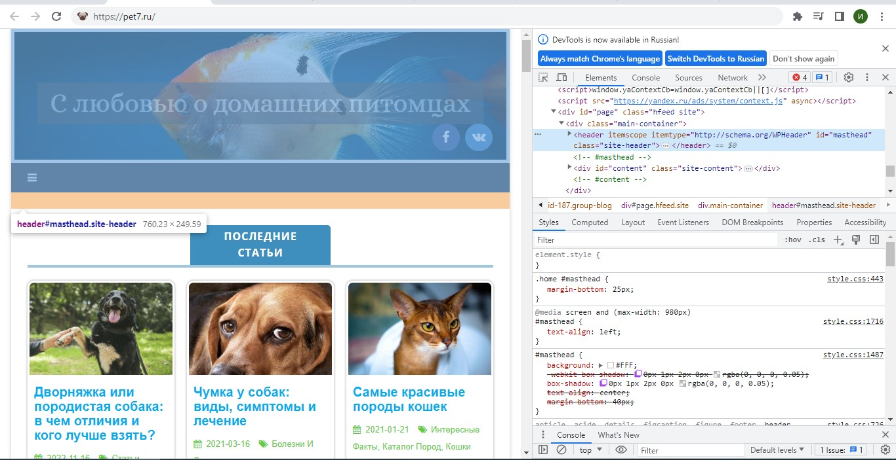
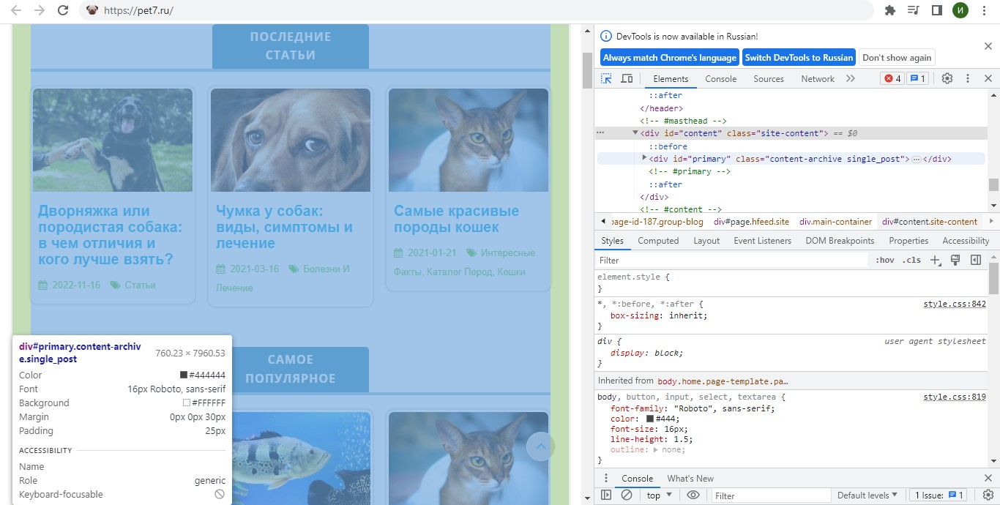
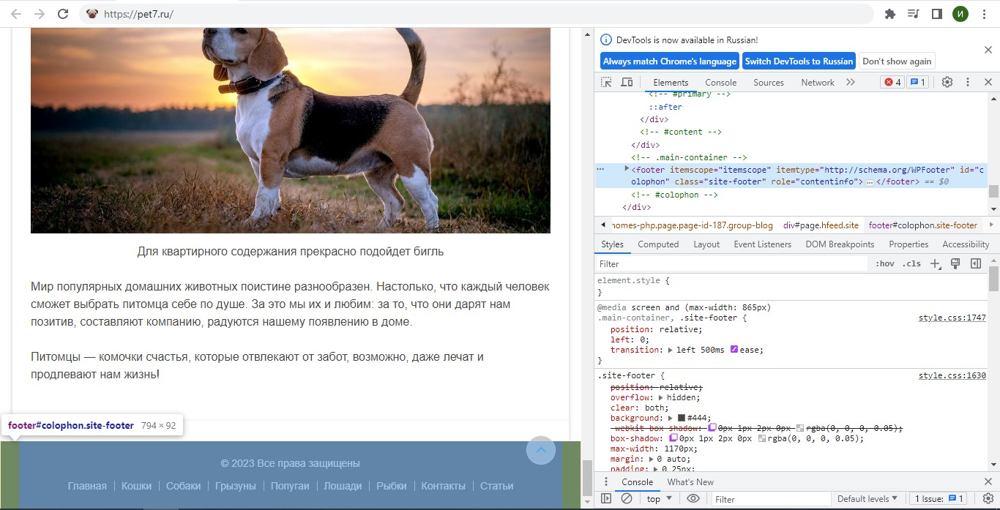

# **Задача: на основе сайта https://pet7.ru/**

## *1. Определите, на каком протоколе работает сайт*
Сайт работает на https протоколе 

## *2. Проанализируйте структуру страницы сайта*

- header (Шапка)

- content (зона контента)

- зона виджетов

- footer (подвал)

## *3. Внесите не менее 3 изменений на страницу с помощью инструмента разработчика и представьте скриншоты было/стало.*

## 3.1. Изменение текста

## 3.2. Изменение статьи

## 3.3. Изменение футера

## *4. Создайте прототип низкой детализации.*

>

